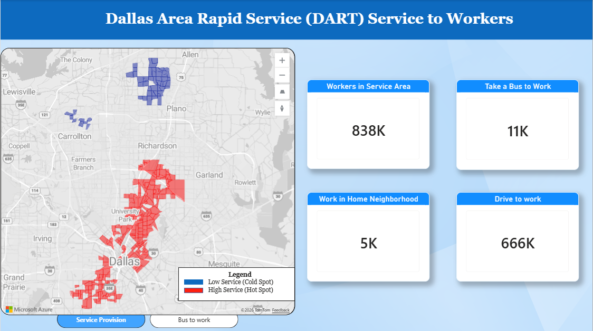
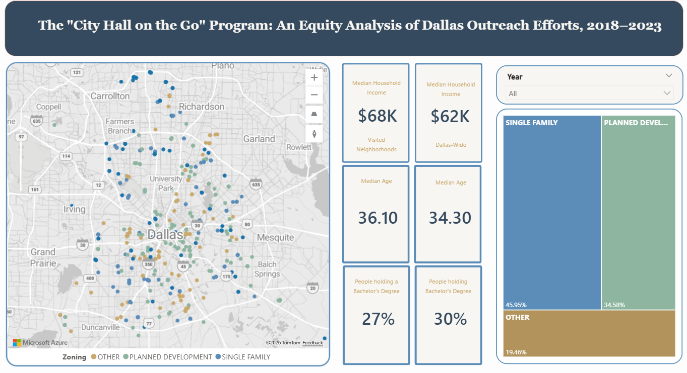

# Moise Dzogolo's Sample Dashboards

This webpage contains a collection of dashboards built with **Microsoft Power BI** to illustrate my data processing and visualization skills.

Please click on the link provided for each item below to view the dashboard. More information about each dashboard can be accessed by expanding the "About this Dashboard" section.

---

## 1. 🚌 DART Service for Workers

> An interactive Power BI dashboard analyzing **Dallas Area Rapid Transit (DART)** bus ridership and workforce transit use patterns across the Dallas metro area.

### 🔗 [▶️ VIEW LIVE DASHBOARD](https://moisedzogolo.github.io/Dashboards/dart-workers/)

 <strong>📌 About this Dashboard </strong> 

 

 This dashboard explores how DART's transit network serves the working population of the Dallas-Fort Worth Metro area, including: 

<ul>
<li> Total number of workers in the metro area, number of workers taking buses to work, and number of workers driving to work.  </li>
<li> Areas of high and low bus service provision (measured as the total number of stops per hour in a neighborhood).  </li>
<li> Areas of high and low use of buses during after-work peak hours (from 4 PM).  </li>
</ul>

<h5> Data Sources: </h5>

<ul>
  <li> <strong> North Central Council of Governments (NCTCOG) </strong>: The service area for the transit agency (DART). </li>
  <li> <strong> American Community Survey (ACS) </strong>: Neighborhood boundaries (Census Block Groups); Total number of workers; Number of Bus riders and number of car drivers. </li>
  <li> <strong> Longitudinal Employer-Household Dynamics (LEHD) </strong>: Number of workers employed within their neighborhood. </li>
  <li> <strong> Smart Locations Database [EPA] </strong>: Bus service provision. </li>
</ul>

<h5> 📊 Key Takeaways: </h5>

<ul>
<li> Less than 2% of workers in the study area take a bus to work.  </li>
<li> Less than 1% of workers are employed in the neighborhood in which they live.  </li>
<li> Outside the area around the center of Dallas, there is a mismatch between the supply and demand of bus service (as evidenced by the maps).  </li>
</ul>

<h5> 📊 Recommendations: </h5>

<ul>
<li> Prioritize zones of high demand in service scheduling.  </li>
<li> Identify factors driving demand for bus service for work commutes.  </li>
<li> Work with municipal governments to promote transit-friendly mixed-use developments.  </li>
</ul>

---

## 2. 🚌 Equity of a Municipal Outreach Program

>  An interactive Power BI dashboard analyzing the exposure of different socioeconomic groups to Dallas's **"City Hall on the Go"** program. The program seeks to bring the government to residents where they live by sending workers to neighborhoods to provide services offered at City Hall, answering questions, and raising awareness about other services that are historically underused.

### 🔗 [▶️ VIEW LIVE DASHBOARD](https://moisedzogolo.github.io/Dashboards/outreach_equity/)

 <strong>📌 About this Dashboard </strong> 

 

 This dashboard examines outreach events held during the 2018-2023 period, and it tracks the following indicators: 

<ul>
<li> Median Household Income.  </li>
<li> Median Age.  </li>
<li> Educational attainment (measured as the share of people holding a bachelor's degree or higher).  </li>
<li> Zoning districts of visited areas.  </li>
</ul>

For each indicator, the dashboard compares the median value for the visited areas to that of the city of Dallas at large.

<h5> Data Sources: </h5>

<ul>
  <li> <strong> American Community Survey </strong>: It was the source of all the demographic data. </li>
  <li> <strong> Dallas Central Appraisal District </strong>: It provided the zoning data included in the dashboard. </li>
</ul>

<h5> 📊 Key Takeaways: </h5>

<ul>
<li> Single-Family Residential areas are the most visited districts, accounting for 46% of all visits during the study period.  </li>
<li> Planned development areas are the second most visited district with 35% of the visits.  </li>
<li> The remainder of zoning districts have negligible shares of visits when taken individually.  </li>
<li> In planned development areas, the primary use of the visited areas is commercial.  </li>
<li> Median household income is slightly higher in visited areas, and so is age.  </li>
<li> Educational attainment is slightly lower in visited areas in the entire study period.  </li>
<li> Patterns have changed over the years for the indicators. Feel free to use the year filter to track the progression of each indicator.  </li>
<li> The most noticeable change is educational attainment, which has dropped for visited areas in 2022 and 2023.  </li>
<li> No data is available for 2021 because the outreach program was paused due to the pandemic.  </li>
<li> Dallas-wide indicators do not change over the years because they represent a 5-year average.  </li>
</ul> 

<h5> 📊 Recommendations: </h5>

<ul>
<li> Low-income areas should be visited more often, as they might have more pressing needs than wealthier areas.  </li>
<li> More outreach effort should also be conducted in multi-family areas. It might increase their civic engagement and bring more diverse views in the policy-making process.  </li>
<li> For future analyses, more indicators should be included for an even better picture of the community.  </li>
</ul>

---

